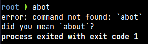
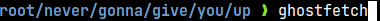

# Phantom - A fantasy OS written in TypeScript

**Phantom** is a fantasy OS for the web, modeled upon Unix, Bash, and POSIX.

## Commands

```text
        echo - displays some text
        help - displays information about builtin commands
          cd - change the shell working directory
       mkdir - create a new directory
          ls - list info about files
       clear - clear the terminal
  ghostfetch - show system information
       touch - create a new file
      cowsay - cow says moo!
       about - info about phantom
         cat - print file to standard output
```

## Features

### Persistent filesystem

Phantom has a persistent filesystem (powered by IndexedDB), as well as commands to help you use it, such as `cd`, `cat`, `mkdir`, and `touch`.


### "Did You Mean?" suggestions

If you make a typo in a command, Phantom's got your back - it'll automatically provide a suggestion that may be relevant.



Under the hood, Phantom uses the [Levenshtein distance](https://en.wikipedia.org/wiki/Levenshtein_distance) to find the closest command in its registry.

### Pretty command prompt

Phantom has a cool command prompt, inspired by [Starship!](https://starship.rs)



---

_© 2024 Mahad Kalam_

_Licensed under the [MIT License](LICENSE.md)_
